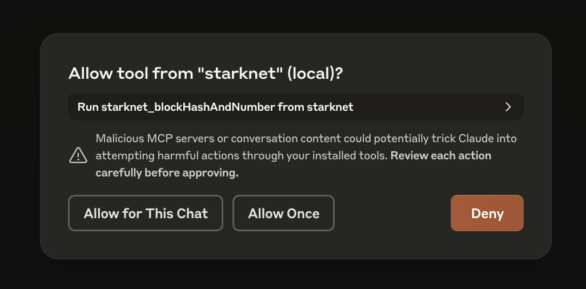
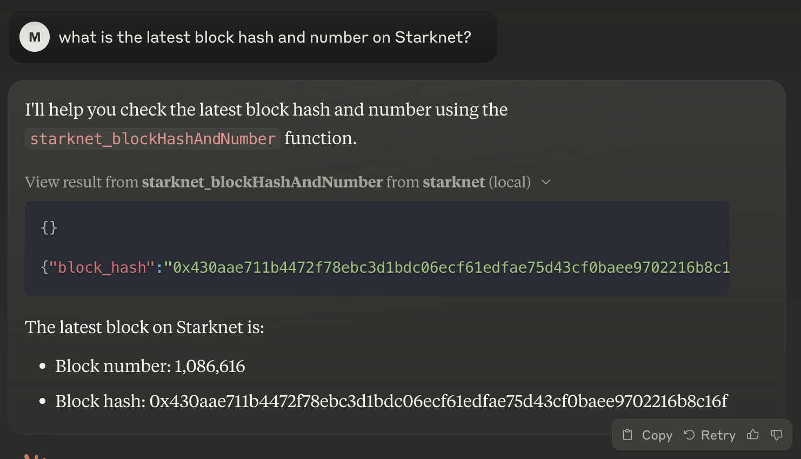

# starknet-mcp

[MCP](https://modelcontextprotocol.io) server for Starknet. Makes the following Starknet RPC method available through MCP:

```text
starknet_getBlockWithTxHashes
starknet_getBlockWithTxs
starknet_getBlockWithReceipts
starknet_getStateUpdate
starknet_getStorageAt
starknet_getTransactionStatus
starknet_getTransactionByHash
starknet_getTransactionByBlockIdAndIndex
starknet_getTransactionReceipt
starknet_getClass
starknet_getClassHashAt
starknet_getClassAt
starknet_getBlockTransactionCount
starknet_call
starknet_getEvents
starknet_getNonce
starknet_blockNumber
starknet_blockHashAndNumber
starknet_chainId
starknet_syncing
starknet_specVersion
```

Write methods are not yet supported.

<a href="https://glama.ai/mcp/servers/kfj96s92mg"></a>

## Installation

Install [Bun](https://bun.sh/). Clone this repo. Install the dependencies with `bun install`. Update Claude's MCP config - see [instructions](https://modelcontextprotocol.io/quickstart/user) for your particular OS. You'll want something like this in the `claude_desktop_config.json` file:

```json
{
  "mcpServers": {
    "starknet": {
      "command": "bun",
      "args": ["/PATH/TO/THIS/REPO/starknet-mcp/index.ts"],
      "env": {
        "STARKNET_RPC_URL": "https://starknet-mainnet.public.blastapi.io/rpc/v0_7"
      }
    }
  }
}
```

## Usage

After correctly configuring Claude Desktop, it will have access to all the available methods. You can start asking Claude questions about the state of the chain, e.g. "What is the latest block hash and number on Starknet?". If Claude determines it has to use an MCP method to answer your question, it will ask you for permissions:



You'll see the used method, its input and output inline in the chat.



## Quirks

Methods `starknet_estimateFee` and `starknet_estimateMessageFee` are not yet supported.

Claude doesn't 100% follow the tool inputSchema. It prefers sending strings over anything else. Some of this is prevented in the code, but if you encounter any error, please open an issue.
